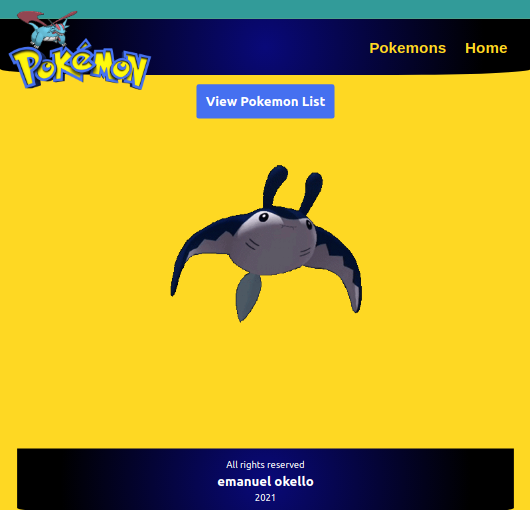

# Pokemon

## Screenshot

## Project Description
- Catalogue of Dog Clothes

This project is an index for pokemons, from the pokeAPI, developed using React/Redux. Here I have practiced the basics of React, like,

- Stateful Functional Components,
- Representational Components,
- React Hooks,
- React Router,
- MAterial UI,
- React Testing Library.
- Emzyme Test Suites.
- Jest Test fixtures.
- React Redux.

## `Build-With:`

- React.
- React-Redux.
- Material UI.
- PokeAPI

## `Live Demo:`

[Pokemon](https://poke-okello.herokuapp.com/)

## `Project presentations:`

[video explanation gist link](https://gist.github.com/oxenprogrammer/da1dcee3dcb62913e25b4df2266bd1cd)

# Getting Started

### `Prerequisites`

To get this project up and running locally, "npm install" is needed to be run in order to include all dependencies used for this project.

**To get this project set up on your local machine, follow these simple steps:**

1. Open Terminal.
2. Navigate to your desired location to download the contents of this repository.
3. Copy and paste the following code into the Terminal$: git clone `https://github.com/oxenprogrammer/pokemon.git`.
4. Into the Terminal: run `cd pokemon`.
5. Into the Terminal: run `npm install`.
6. Into the Terminal: run `npm run dev`.
7. To see the website in the browser, open browser and load `localhost:3000`.
8. Checkout the `script` in the `package.json` file for more commands.

**To run the test suits:**

1. Into the Terminal: run `npm run test`.
2. Press `a` to run all tests.

## Author
👤 **Emanuel Okello**

- GitHub: [oxenprogrammer](https://github.com/oxenprogrammer)
- Twitter: [@ox_emmy](https://twitter.com/ox_emmy)
- LinkedIn: [Emanuel Okello](https://www.linkedin.com/in/emanuel-okello/)

## `Show your support:`

Give ⭐ Star me on GitHub — it helps!

## 📝 `License`

This project is [MIT](./LICENSE) licensed.